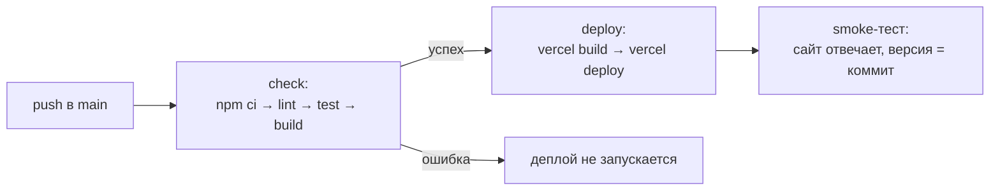
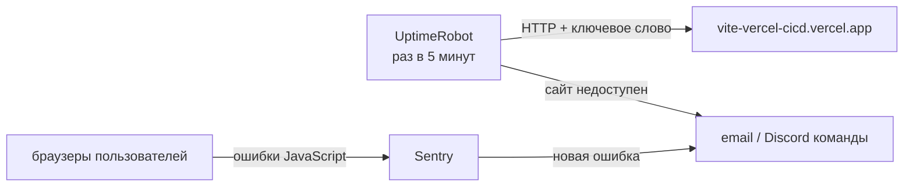

# CI/CD для демо-приложения на Vercel

Тестовое задание Junior DevOps: при пуше в `main` автоматически запускаются линтер и тесты, и только если они прошли, приложение деплоится на Vercel.

- **Сайт:** https://vite-vercel-cicd.vercel.app
- **Пайплайн:** [.github/workflows/ci-cd.yml](.github/workflows/ci-cd.yml), запуски во вкладке [Actions](https://github.com/sK8le/vite-vercel-cicd/actions)

## Как устроен пайплайн



Два джоба в GitHub Actions:

1. **check**: `npm ci` ставит зависимости строго по `package-lock.json`, затем линтер (ESLint), тесты (Vitest) и сборка (Vite). Шаги идут от быстрых к медленным, чтобы ошибка находилась как можно раньше.
2. **deploy**: запускается только после успешного `check` (`needs: check`). Vercel CLI собирает проект на раннере и выкладывает готовую сборку (`--prebuilt`), поэтому в продакшен попадает ровно то, что прошло проверки.

Встроенный автодеплой Vercel отключён (`vercel.json`, `git.deploymentEnabled: false`): он срабатывает на каждый пуш независимо от тестов, а деплой должен зависеть от проверок.

Сверх задания добавлен smoke-тест после деплоя: он проверяет, что сайт отвечает, и что в `/version.txt` лежит хэш текущего коммита. Так видно, что на сайте именно новая версия, а не просто «деплой завершился».

**Проверено на практике:** коммит с намеренной ошибкой в коде упал на тестах, деплой не запускался, на сайте осталась предыдущая версия ([запуск](https://github.com/sK8le/vite-vercel-cicd/actions/runs/37024285548)). Ошибка затем отменена через `git revert` ([запуск](https://github.com/sK8le/vite-vercel-cicd/actions/runs/37024509694)).

## Почему такие инструменты

| Что | Почему |
|---|---|
| GitHub Actions | Код уже на GitHub, CI бесплатный и не требует своего сервера |
| Vercel | Managed-хостинг без своих серверов: статика на CDN и HTTPS из коробки |
| Vite, Vitest, ESLint | Минимальный стек: Vitest использует конфиг Vite, отдельная настройка не нужна |
| Закреплённые версии | Node в `.nvmrc` (одна версия локально и в CI), зависимости в `package-lock.json`, Vercel CLI и ОС раннера в workflow. Сборка не меняется сама по себе |

Секреты (`VERCEL_TOKEN`, `VERCEL_ORG_ID`, `VERCEL_PROJECT_ID`) хранятся в GitHub Secrets, у токена Vercel ограниченный срок действия, у `GITHUB_TOKEN` права только на чтение.

## Мониторинг доступности (предложение)



1. **UptimeRobot, бесплатный план.** HTTP-монитор главной страницы и keyword-монитор на текст заголовка, проверка раз в 5 минут. Оповещения на email и в Discord (Telegram и Slack доступны только на платных планах). Бесплатная публичная страница статуса.
2. **Sentry.** Ловит ошибки JavaScript в браузерах пользователей. Страница собирается в браузере: если скрипт сломается, сервер всё равно ответит 200, а пользователь увидит пустой экран. UptimeRobot такое не заметит, а Sentry заметит.
3. **Smoke-тест в CI** уже проверяет сайт сразу после каждого деплоя.

Если сайт недоступен: проверить [статус Vercel](https://www.vercel-status.com) и последний деплой. Если проблема в новой версии, откатиться на предыдущий деплой (Instant Rollback в Vercel) и чинить через обычный пуш в `main`.

## Что бы добавил дальше

- Проверки на pull request до слияния и защиту ветки `main`.
- Preview-деплой для каждого pull request.
- Закрепление сторонних actions по SHA коммита.

## Локальный запуск

```bash
nvm use
npm ci
npm run lint && npm test && npm run build
npm run dev
```
